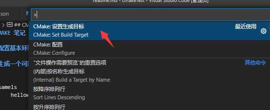
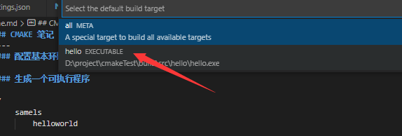
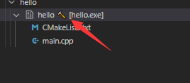
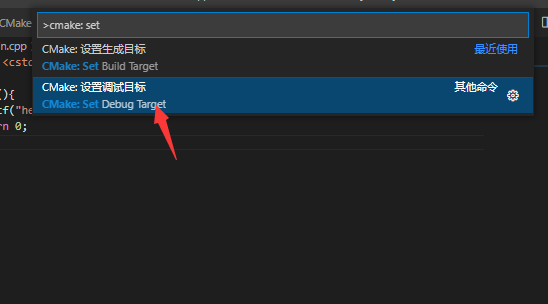

## CMAKE 笔记
---
### 配置基本环境

### 生成一个可执行程序

* src
    * samels
        * helloworld
    * slib 


```cmake
cmake_minimum_required(VERSION 3.22.0)

```
###设置build target  然后按F7 生成exe

1.ctrl+shift+p



2.


设置成功后会显示一个小锤子




### 设置 debug target  然后按ctrl+F5调试





